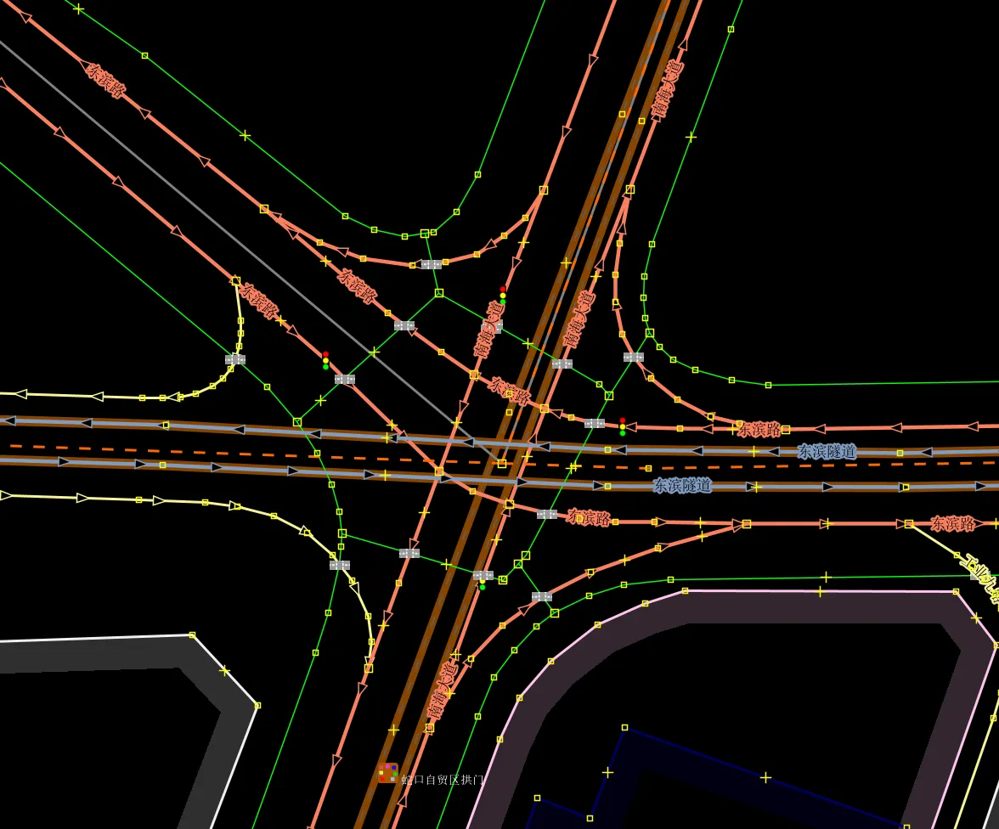
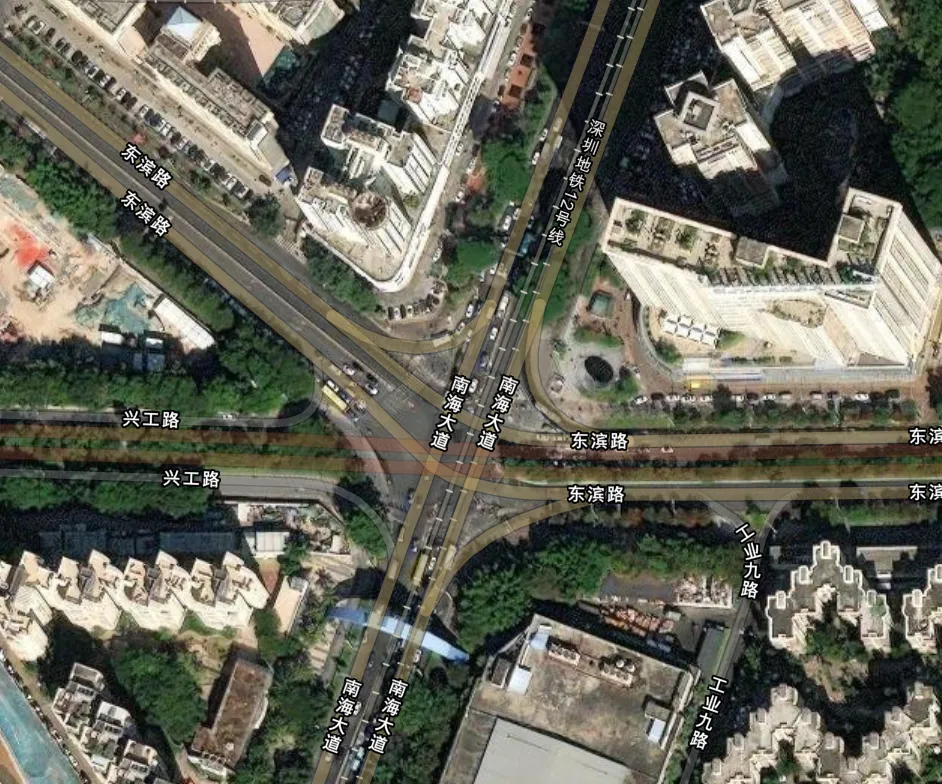
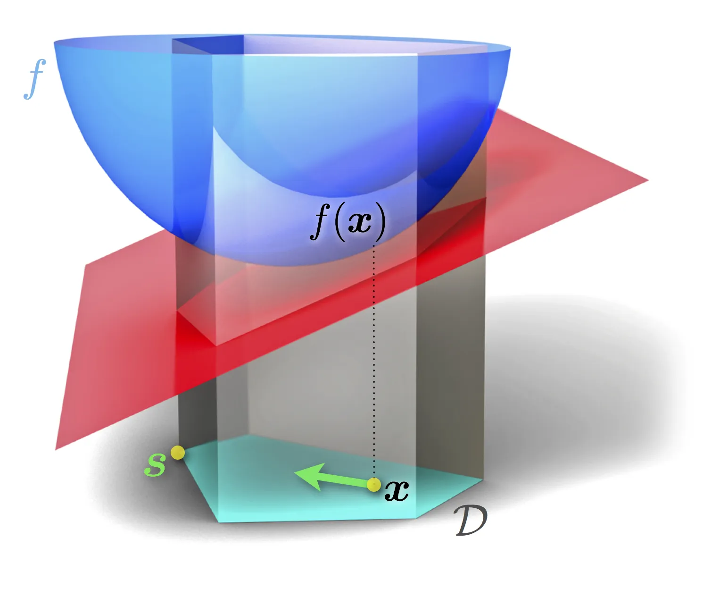
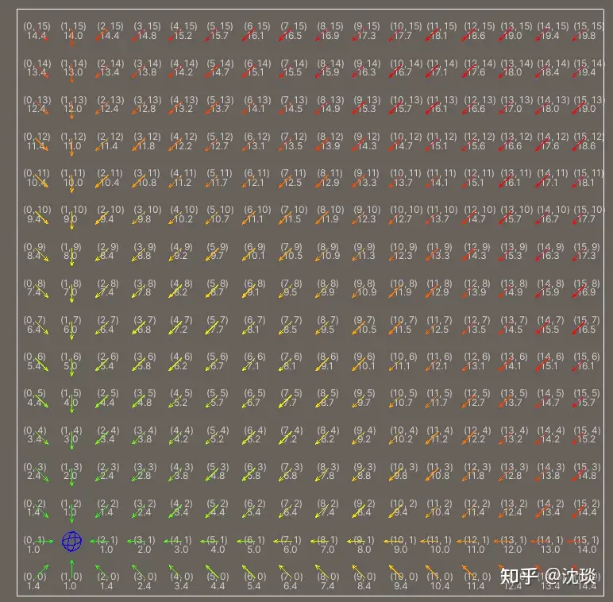
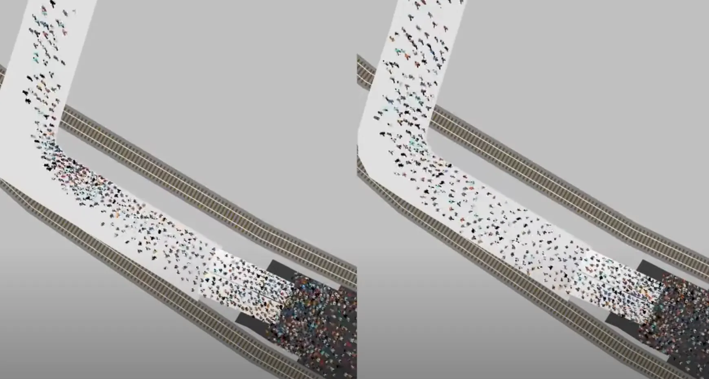
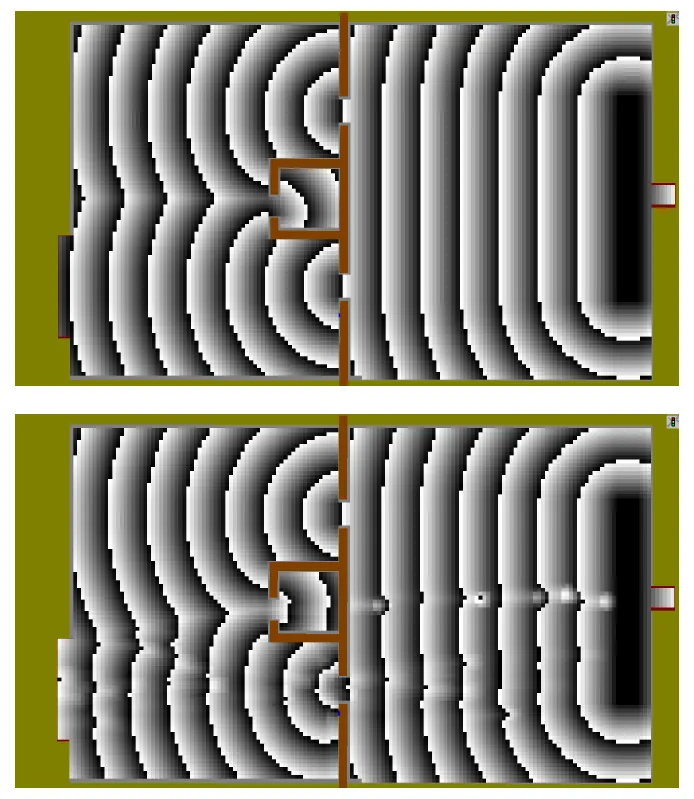
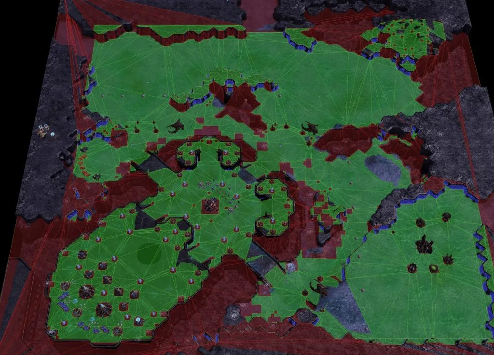
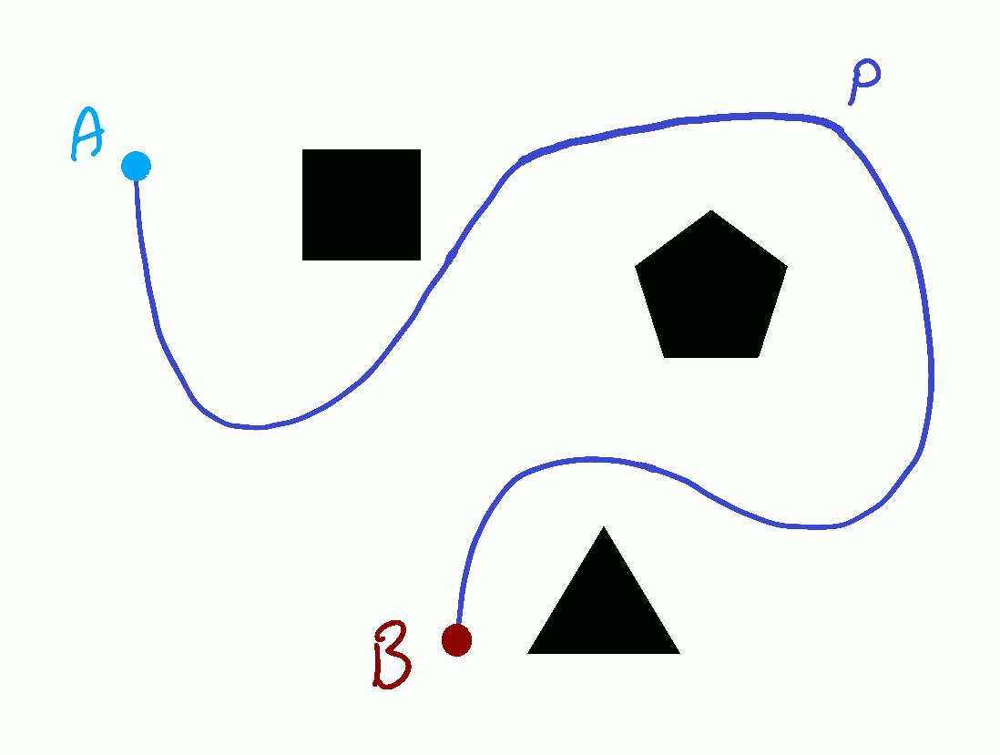

**——寻路算法篇**

> 「CPU is fast and MEMORY is slow. 」 
>
>                                                                      ——By James Anhalt 
>

### 前言
作为一个从「星际争霸：母巢之战」和「红色警戒：尤里的复仇」时代一路走来的准中年RTS爱好者，见证了RTS游戏曾经的辉煌和而今的式微，目睹暴雪作为最顶尖的PC游戏厂商从神坛拾级而下，核心团队出走，到国服战网「Battle.Net」停服，再到微软收购案尘埃落定。这篇文章写在战网国服重开前夕，包含了个人对RTS游戏科技以及与城市微观交通仿真同构性的认知和分析，也可视为五年交通模型仿真生涯的一处注脚。

---

### 1 游戏与仿真——同卵双生
即时战略游戏（Real-Time Strategy Game）简称RTS，是公认最复杂的一类游戏，与当下市面上大火的开放世界RPG，如《黑神话·悟空》等「3A大作」不同（当然不少RTS游戏出世便是3A），在游戏玩家与游戏对象的控制-交互计算层面，RTS游戏的核心追求不是精致的场景-动作设计，物理模型构建和电影级的画面渲染，**而是给定游戏规则下，多主体复杂交互时极致流畅的行为-状态更新及控制响应**，因此核心技术难点在于如何在基础架构、核心算法、数据存储设计等方面，通过优化实时运算需求，使普通的消费级CPU也能承受住极限压榨。

具体来讲，RTS游戏内核需要保证成百上千个单位之间复杂的行为交互自然且流畅地随时间步更新，处理单位或单位群组（swarm）的实时寻路，响应高频的玩家指令，以及在显示器上结合视角控制加载相应地图空间中的对象并完成渲染——这些任务大都集中于CPU，通过线程间的协同完成（2010年前，计算机都还是以单核为主，因此存在架构选型的客观限制。SCⅡ在虚空之遗版本发布前，被调侃为1.5核游戏，从虚空之遗正式支持双核），因而CPU的主频决定了游戏最重要的体验指标——**「帧率」**。高帧率的背后是计算机程序能够更加高效地执行指令，高频地更新全部对象的状态，同时输出给前端完成渲染，玩家能因此及时获取信息并迅速交互反馈。可以说，在不考虑网络延迟影响下，计算机CPU的性能从根本上决定了玩家“微操”空间。

和RTS游戏类似，微观交通流和行人仿真包含了复杂的「人-车-环境」交互动态、人与车的实时寻路（包括行人避障以及车辆换道行为）以及大范围空间下对指定地图范围中个体和环境的2D/3D渲染，同样是CPU密集型任务。事实上，无论是微观车流仿真、行人仿真，还是各种各样的RTS游戏，都可以归类为“**复杂非线性系统仿真**”，他们的共有特征在于：

1、需要对实时地图进行建模并结合对象当前位置和目的地行进要求，完成实时路径求解；

2、要对成百上千个Agent的动态以及其与周边个体和环境的交互进行步进追踪和解算。

对于前者，可以结合各类寻路算法以及配套的地图结构予以实现，而对后者，则需要根据建模对象特性构造对应的行为算法，如车流仿真中的**跟驰模型**和**换道模型**和行人仿真常用的**社会力模型**，以及RTS游戏中基于游戏规则以及单位设定，设计的各种行为模型。在本文中，将重点介绍寻路算法，并比较分析游戏与仿真的共性与差异。

### 2 地图表示和寻路算法
地图是仿真空间计算的基础，地图中的各类元素构成了仿真世界的“环境”，基于环境和个体位置信息，可以精确衡量仿真单位、起讫点的位置。继而结合地图类型以及对应的优化设计的数据结构，快速求解最优路线。

游戏通常包含两种主要的地图类型：开放式地图和线性地图。这一分类同样可以类比于虚拟环境仿真。在开放式地图中，角色可以自由地向各个方向移动，探索广阔的世界；而在线性地图中，玩家需要按照设计者设定的路线和剧情时间线逐步推进。许多RTS游戏采用开放式地图，单位可以在一定规则下自由移动，类似于行人仿真中个体在给定空间内的自由活动。相比之下，车流仿真则受限于道路网络，车辆必须沿着固定的路径行驶，这种结构可以看作一种特殊的“线性地图。

#### 2.1 拓扑地图和最短路
##### 2.1.1 导航地图的拓扑图
在我们常用的导航地图中，通过拓扑图(Topological Graph)，用节点代表路口，边代表道路来对道路网络进行描述。它不仅能表示不同道路间的联通关系，通过在边上存储距离、时间等信息，进一步形成权重图（weighted graph），这种图能帮助计算最短路径、分析交通状况，并用于导航系统。构建和优化拓扑图需要处理大量数据，是现代导航和路径规划的核心工具。

##### 2.1.2 基于拓扑图的经典最短路算法——Dijkstra和A*
传统交通流仿真中，至今仍广泛采用经典的基于图论的算法——Dijkstra算法，以及由Dijkstra算法演化的A*算法（二者还有各种改进类型），来完成一对一的单车路径解算，主要因为仿真对象的OD(起终点)往往各不相同，在拓扑网络中，尽管可以一次性解算所有点对之间的最短路径，但开销同样会指数级上升。因此，在实际仿真前（或是车辆进入路网前），采取一次性或者流式批次的方法完成预解算，仍然是通行的方式。

### 2.2 考虑路径容量的流量均衡算法
从Greenshield的交通流-密-速关系理论可知，当路网交通流密度增大到一定程度后，单位时间内允许通过的流量将逐渐下降。在个体层级路径规划过程中，假如起终点相同的个体数量过多，大家都选择最短路径可能反而引起拥堵。在城市道路网络层级，网络的行程时间理想上应该维持在接近纳什均衡（Nash Equilibrium）的水平，即任一个个体的路径优化，都必然以为其他个体带来额外的路径成本损失为代价。在交通工程学中，我们也将之称为用户均衡态。从数学上，求解网络流量均衡状态的问题可以等效为带约束凸优化问题，采用经典的Frank-Wolfe迭代算法进行求解。

Frank-Wolfe算法通过将非线性目标函数在当前解处线性化，将原问题转化为一系列线性子问题，从而逐步逼近最优解。在流量均衡场景中，算法利用当前流量状态下的路径成本梯度，计算最优下降方向，并将流量分配到成本较低的路径上，同时满足路径容量约束。每次迭代通过线性搜索确定步长，更新流量分布，直至收敛。Frank-Wolfe算法的优势在于其简单性和对大规模网络的高效求解能力，尤其适合处理路径容量受限的复杂交通分配问题。

### 3 基于Tile map的导航网格（Navmesh）与流场寻路「Flow Field Pathfinding」
#### 3.1 导航网格与流场
在经典行人仿真或RTS游戏，如星际争霸1、红色警戒、魔兽3）中，由于需要在开放式大地图中寻路，采用栅格化地图用于定位和数据存储。在栅格化的导航网格中进行路径搜索时，如果同时存在大量需要实时进行路径解算的对象，一对一求解方法性能开销也呈线性增长，因此催生了以**流场寻路+ A*算法** 为代表的高效算法。流场寻路通过在网格空间中构建用于路径引导的“场”，可以类比为磁场或者势场这类向量场「vector field」，对具有相同目的地的单位实现共享路径诱导。这类简化的前提在于，无论游戏或是仿真，都存在多个单位向同一目的地运动的需求。因此可以一次性构建全图的路径解算信息，共享给所有对象，由于只需要一次计算，从而既节省了时间，也降低了内存消耗。

构建流场可以采用Bushfire算法，即从原点开始，对网格前后左右的相邻格子依次进行cost计算，每次+1，被重复计算的格子则取最小值，像野火燎原一样遍历全图。这里搬运我认为非常漂亮的一张图（来自知乎[@沈琰](https://www.zhihu.com/people/4279e43465ffea93a4b4e2db05ee6d38)）

#### 3.2 动态势能——最短路径与最优路径的权衡
Navmesh提供了一个静态的场用于路径求解，这种方式在大多数场景下可能已经满足要求，但当我们考虑这样的情况：在一个人流量很大的L型通道转角，假设所有人都选择最短路，甚至会导致排队或者拥堵，而我们如果选择沿着外侧行走来规避拥挤，反而能更快地通过。这是因为在静态场下，最短路并不会考虑人与人之间可能产生的拥挤或者反应延迟带来的空间占用，因此在模拟典型的大流量疏散场景时容易导致和真实情况不一致，可以参考PTV官方提供的案例（见下图，油管链接：[https://www.youtube.com/watch?v=8SmRBTJ-jeU](https://www.youtube.com/watch?v=8SmRBTJ-jeU)）。

为了解决仿真计算的“最短距离路径”与个体决策的“最短时间路径”不一致的问题，PTV VISWALK中增加了基于动态势能（dynamic potential）的路径解算模式。之所以叫动态势能，是因为它会结合场景下行人对网格空间的占用，通过预测当前实际通过每一个网格的时间来动态地更新整个流场。根据 [Tobias Kretz](https://arxiv.org/abs/1107.2004) 的论文，动态势能计算包含主要三个步骤：首先，计算出一个小区域的预期或估计步行速度图，其中会考虑到障碍物的分布、人员以及可能影响速度的其他属性。第二步：从目的地区域开始，采用数值艾克纳方程（numerical Eikonal equation）求解器对所有地块的行走时间进行数值积分，估计到目标区域的剩余行程时间（这一步解算需要往往消耗非常多资源）。第三步是基于当前的时间场计算所有被行人占用，具有相同目的地的网格的梯度。由于引入动态势能后计算开销极大，会明显影响仿真性能，在VISWALK中，默认10个仿真步才更新一次。

**与Viswalk相似，数值艾克纳方程同样被应用在了星际2的寻路优化中**，用于估计单位在不同地形和区域中的的真实行走时间，实现更智能（或者说是自然）的游戏单位寻路行为。尽管星际争霸通过一系列对地图空间的优化降低了需要进行动态行走时间估计的单元数量，在实际仿真过程中仍然无法做到单步更新，因而单位寻路在极少数情况下同样会出现**Bug**。

> 对于游戏寻路，通常没有消息就是好消息，如果寻路引擎运行良好，没人会真正注意到；如果它运行不好，那总是你的错（In the pathing game, usually no news is good news. It's kind of a thankless job, and if it works well, nobody really notices, if it doesn't work well, it's always your fault.）
>
>  ——James Anhalt
>

寻路对玩家来讲是游戏中最无感的组成，但由于寻路过程天然占用大量计算资源，一旦由于设计缺陷导致运转不佳，就可能带来灾难性后果：不仅是在延迟方面影响用户体验，还可能造成单位控制过程中的异常寻路行为。

在我看来，这种及难被玩家感知的BUG，其存在本身就是JAMES领导的暴雪寻路引擎开发小组在技术领域披荆斩棘，用热爱浇灌游戏史SOTA of Path Finding空谷幽兰的无形见证。

#### **3.3 德劳内导航网格**（Delaunay Navigation Mesh）——性能再优化
##### 3.3.1 如何在地图侧实现优化？
行人仿真需要在计算条件允许的前提下尽可能提升与现实世界的对齐水平，因此诞生了动态势能用于个体寻路行为的精细化模拟。而在RTS游戏中，更加关键的是高效计算带来的顺滑的手感。在早期经典游戏（如魔兽3以及沿用魔兽3引擎的星际争霸1）中，方格式的导航网格配合A*算法通过流场信息共享实现了寻路计算的减负，这是在寻路侧的优化，那么，在地图侧是否也同样具有优化空间呢？

答案是肯定的。基于网格构建的地图，在固定地理空间内，地图规模取决于网格大小，网格数量越多，规模越大，地图越精细，对应占用的内存空间就越大。而由于内存访问速度远小于CPU计算操作速度，超大内存占用下的频繁内存调用会造成致命的性能瓶颈。由于网格数量决定了寻路算法中底层拓扑图规模，而路径解算的结果是所经节点的有序组合。我们自然而然能想到，寻路过程中，能否采用更好的空间划分方式，通过减少网格面的数量来压缩拓扑规模，减少非必要的路径中间点，从而有效地提升寻路效率？

从SC1到SC2，暴雪正是基于这一思路，使寻路引擎性能得到跨越式升级。**而这个2010年左右诞生的引擎，时至今日仍然具备着傲视群雄的超一流技术水平。**

##### 3.3.2 CDT——带约束的德劳内三角剖分
带约束的德劳内三角剖分「CDT-Constrained Delaunay Triangulation」是当前游戏开发和机器人导航中被广泛采用的技术，用于在复杂三维场景下，描述游戏或虚拟环境中的可行走区域。带约束的德劳内三角剖分有许多优良性质：它能够在对全图可行空间（可以包含起伏的地形）进行无间隙三角化的同时，使得全部三角形中的最小内角最大化，从而避免不良形态三角形的出现。德劳内三角能够灵活地表示复杂地形特征（如悬崖、坡道等），支持真实的对角路径。同时，德劳内三角剖分是一个确定性的过程，生成结果不受随机因素的影响——这一点在联网游戏中非常重要，因为仿真计算往往在客户端完成，而不同平台上重建的网格必须保持一致，才能实现仿真结果的唯一性。

在星际争霸2默认256*256的地图中，如果采用常规的网格化方案，大约需要64000个网格，而采用CDT方案只需要2000+三角形。A*算法理想状态下是线性复杂度「O(V+E)」，如果不考虑三角划分的时间（可以提前预处理），采用CDT+A*的方式理论上能实现20倍以上的性能提升。同时由于将数据量缩减到了CPU单靠缓存就能消化的水平（每个三角形仅用 **16byte存储邻接关系**，而每个顶点只需4byte用于索引），不需要使用动态内存（DRAM），IO消耗的大幅减少使得计算延迟得到了进一步改善。

StarCraft 2 Navmesh （基于CDT）

##### 3.3.3 漏斗算法
漏斗算法（Funnel Algorithm）是一种经典的几何寻路算法，在游戏AI寻路、网格寻路、机器人路径规划等领域都有广泛应用。漏斗算法可以实现极致简约、快速并且精准的寻路。关于漏斗算法的介绍可以参考下图的文章（标题超链）。或者这篇：[图解NavMesh寻路中的漏斗算法](https://www.cnblogs.com/pointer-smq/p/11332897.html)

[The Funnel Algorithm ](https://medium.com/@reza.teshnizi/the-funnel-algorithm-explained-visually-41e374172d2d)

##### 3.3.4 SC2寻路引擎的工作流程
**在暴雪的方案中，寻路过程分为high-level和low-level两个层级。首先在high-level，游戏采用带约束的德劳内三角剖分****（Constrained Delaunay Triangulation）**表示游戏世界，取代了传统规则网格，**实现了地图的最优分割**。这种结构能更好地处理对角线地形和复杂几何，但三角网格的查询（定位某点属于哪个三角形）复杂度较高**。**A*算法在CDT上运行时，依赖Jump and Walk快速获取起点和终点的三角形，大幅缩短路径规划时间。**紧接着，在low-level，通过在上high-level选定的三角形中使用漏斗算法，完成更为平滑的最优路径的规划。**

进一步，由于玩家高频控制指令的介入，不少游戏单位的路径信息会被频繁修改，例如：为了攻击一个敌方目标，路径求解器给出了接下来需要100个仿真步才能走完的线路（假如游戏以10Hz的频率更新，则意味着游戏单位经过10s到达终点），但仅过了30个仿真步（3s），这个单位便被玩家指挥去攻击新的目标，原有保存的需要70个仿真步才能走完的路径数据就成了冗余信息 ，只会空耗内存。当对象数量过多时，内存读写本身会造成极大的性损耗乃至延迟，因此，暴雪在星际2寻路引擎中只存储短时路径信息，这样的方式不仅节省内存，还使得IO效率大大提升。

此外，暴雪还结合**优先队列（Priority Queue），延迟清除关闭集（Delayed Clearing）**等优化技术对A*算法性能进行优化提升——所有改进依然在不使用任何动态内存的前提下，保证算法搜索性能提高的同时不产生额外的IO压力。

### 4 小结
无论是游戏还是仿真，寻路引擎在具备复杂动态环境和可移动对象的大规模多智能体演化系统计算中，都可以视为最重要的组成，它是算法科学、软件工程学和日新月异的计算硬件经过精密设计和组合下的结晶。寻路引擎不仅基于高效的路径规划算法来应对动态环境中的实时需求，还需要结合碰撞模型、行为模型等，以支持大规模智能体的协同与交互模拟。

随着AI时代到来，寻路引擎正在向更智能、更高效的方向发展。基于GPU并行计算和分布式架构有望进一步提升系统仿真效率，但多线程并行下可能的对确定性仿真特性的损害，或将成为制约其在现有场景下进一步发展的阿喀琉斯之踵。在游戏同步与一致性以及对实验复现有着无法妥协的约束的确定性仿真当前，现有CPU集中型计算模式，在SC2的架构下或已臻于完美。但对交通仿真软件，尤其在行人领域，依然有很大的提升空间。继续在当前单核架构下进行大刀阔斧的优化，还是果断转向GPU并行实现“弯道超车”，背后既有软件开发商沉重技术栈的历史包袱必须正视，也有新的应用场景不断涌现下，对技术路线选择的深刻思考与权衡。

#### 参考资料及链接：
[1] GDC 2011 Al Navigation: It's Not a Solved Problem - Yet James Anhalt

[2] Next Gen Networked Games - Networking Physics / Lockstep VS State sync (Episode 2)

Youtube y.P.NextGenNetGames

[3] 游戏服务器架构:网络游戏同步技术概述([https://cloud.tencent.com/developerarticle/1805469](https://cloud.tencent.com/developerarticle/1805469))

[4] RTS Pathfinding 2: Dynamic Navmesh with Constrained Delaunay Triangles

idtec([https://www.jdxdev.com/blog](https://www.jdxdev.com/blog))

[5] Demyen, D.J.(2007)Efficient Triangulation-Based Pathfinding,skatgame.net([https://skatgame.net/mburo/ps/thesis_demyen_2006.pdf](https://skatgame.net/mburo/ps/thesis_demyen_2006.pdf))

[6] 流场寻路：[https://www.honkai-rts.com/2023/02/18/FlowFieldPathFinding/](https://www.honkai-rts.com/2023/02/18/FlowFieldPathFinding/)

[7] 像《红警》里的大兵那样找路（上）——全局向量场寻路([https://zhuanlan.zhihu.com/p/562570278](https://zhuanlan.zhihu.com/p/562570278))

[8] 跳点搜索算法JPS及其优化([https://runzhiwang.github.io/2019/06/21/jps/](https://runzhiwang.github.io/2019/06/21/jps/))

[9] RTS集群运动（[https://sandruski.github.io/RTS-Group-Movement/](https://sandruski.github.io/RTS-Group-Movement/)）

[10] 三角剖分与Delaunay三角剖分及带约束的Delaunay三角剖分：

[https://blog.csdn.net/A15505289299/article/details/79169994](https://blog.csdn.net/A15505289299/article/details/79169994)

